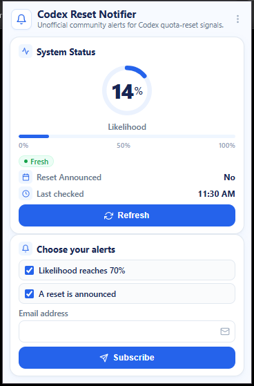

# Codex Reset Notifier

> **Chrome Extension & Serverless Cloud Platform** to monitor OpenAI Codex quota reset cycles in real-time and deliver instant email alerts.

[](docs/testing-strategy.md)
[](https://workers.cloudflare.com)
[-blue?style=flat-square>)](https://developers.cloudflare.com/d1/)
[](packages/extension)
[](https://resend.com)

---

<p align="center">
  
</p>

---

## 📖 Overview

**Codex Reset Notifier** is an end-to-end monitoring and notification platform built for developers and AI engineers who rely on OpenAI Codex quota resets. Instead of constantly checking status pages manually, this extension tracks quota reset likelihood automatically and delivers alerts straight to your inbox.

- **Frontend:** Chrome Extension (Manifest V3) with a modern, high-density dashboard featuring a circular likelihood gauge, live status, and one-click subscription management.
- **Backend:** Cloudflare Workers running every 15 minutes via Cron triggers, backed by a resilient Cloudflare D1 SQL database.
- **Delivery:** Transactional email alerts powered by Resend with SPF/DKIM verified domain (`alerts@notidex.click`).

---

## ✨ Key Features

### 1. 📊 Real-Time Forecast & Gauge Dashboard

- **Dynamic Circular Gauge:** Displays current quota reset probability (0–100%) with an animated progress meter.
- **Freshness & Status Indicators:** Visual health badges (`Fresh`, `Stale`, `Unavailable`) and instant last-checked timestamps.
- **Announcement Detection:** Tracks whether an official reset has been announced.
- **Manual Refresh:** On-demand status refresh with rate-limit protections and duplicate request prevention.

### 2. 🔔 Dual Smart Alert System

- **Likelihood reaches ≥ 70% (`PROBABILITY_REACHED_70`):** Advance warning notification allowing you to prepare your workflows.
- **Reset is announced (`RESET_ANNOUNCED`):** Immediate alert when an official reset is confirmed.

### 3. 📧 Privacy-Preserving Email Alerts

- **Granular Preferences:** Subscribe to 70% threshold alerts, announcement alerts, or both.
- **Double Opt-In Security:** Safe email confirmation flow to prevent unsolicited subscriptions.
- **Self-Service Management:** Manage preferences or unsubscribe permanently anytime at `/manage`.

### 4. 🛡️ Hardened Security & Zero Tracking

- **Hardened Origin Routing:** Extension communicates only with the dedicated Worker API; never hits third-party APIs directly.
- **HMAC Rate Limiting:** Rate limits use HMAC SHA-256 hashes—raw IP addresses and emails are never exposed.
- **No Third-Party Analytics:** Zero trackers, zero ads, zero data sharing.

---

## 🚀 Live Endpoints & Production Resources

| Resource                | Value                                                   |
| :---------------------- | :------------------------------------------------------ |
| **Worker API URL**      | `https://notidex.click`                                 |
| **Status Endpoint**     | `GET /api/status`                                       |
| **Privacy Policy**      | `https://notidex.click/privacy`                         |
| **Management Portal**   | `https://notidex.click/manage`                          |
| **D1 Database**         | `codex_reset_prod` (`e0b99231-cd4e-4e78-bfa3-99a1b6cbdd61`) |
| **Sender Domain**       | `alerts@notidex.click` (Resend verified)                |
| **Chrome Extension ID** | `oecegicjjbjgdaipabophafmkgaieohl`                      |

---

## 📦 How to Install & Run the Extension

### Method 1: Load Unpacked (Development / Manual Installation)

1. Clone this repository or download the repository ZIP.
2. Open Google Chrome (or any Chromium browser like Brave, Edge).
3. Navigate to `chrome://extensions`.
4. Turn ON **Developer mode** (toggle in the top-right corner).
5. Click **Load unpacked** and select the [`extension-release/`](extension-release) folder from this project.
6. Click the extension icon in your browser toolbar to open the popup dashboard.

### Method 2: Packaged ZIP (Chrome Web Store format)

- Ready-to-upload archive: [`extension-release.zip`](extension-release.zip)
- SHA-256 Checksum: [`extension-release.zip.sha256`](extension-release.zip.sha256)

---

## 🏗️ Architecture & Monorepo Structure

```
codex-reset/
├── packages/
│   ├── shared/         # Domain models, Zod validation schemas, API contracts
│   ├── worker/         # Cloudflare Worker API, Cron scheduler, D1 persistence, Resend integration
│   └── extension/      # Chrome Extension MV3 popup UI & API client
├── docs/               # Architecture, domain model, database schema, and operational runbooks
│   ├── images/         # Extension UI screenshots and visual assets
│   ├── runbooks/       # Secrets, D1, deployment, monitoring, and rollback runbooks
│   └── phases/         # Specifications and completion reports for Phases 0–9
├── scripts/            # Release verification, preflight checks, and extension packaging
└── artifacts/          # Generated deterministic verification reports & release checksums
```

---

## 🛠️ Development & Testing

### Prerequisites

- Node.js >= 20.0.0
- npm >= 10.0.0

### Setup

```bash
# Clone the repository
git clone https://github.com/hoonz565/codex-reset-noti-extension.git
cd codex-reset-noti-extension

# Install dependencies cleanly
npm ci
```

### Common Commands

```bash
# Run all tests across workspaces (727 tests)
npm test

# Run code format check & linter
npm run format:check
npm run lint

# Run TypeScript typechecks across workspaces
npm run typecheck

# Build all packages (shared, worker, extension)
npm run build

# Package deterministic Chrome Extension ZIP
npm run package:extension

# Run full release verification runner
node scripts/run-verification.cjs
```

---

## 📚 Documentation

- [Project Roadmap](docs/roadmap.md)
- [System Architecture](docs/architecture.md)
- [Domain Model & Lifecycle](docs/domain-model.md)
- [Database Schema & Migrations](docs/database-schema.md)
- [API Contracts](docs/api-contracts.md)
- [Testing Strategy](docs/testing-strategy.md)
- [Operational Runbooks](docs/runbooks/)

---
_Disclaimer: This is an independent community tool and is not affiliated with, endorsed by, or sponsored by OpenAI._
